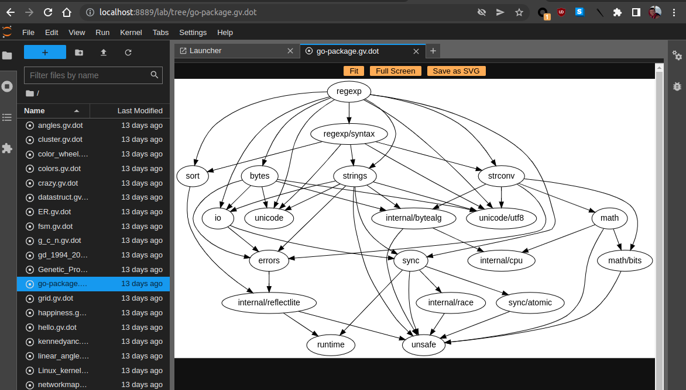

# jupyterlab_graphviz

A JupyterLab extension for rendering graphviz-dot or svg files.

## Overview

This jupyterlab extension allows to display, zoom into, and snapshot as [svg](https://en.wikipedia.org/wiki/Scalable_Vector_Graphics):

- [dot](<https://en.wikipedia.org/wiki/DOT_(graph_description_language)>) files
- [svg](https://developer.mozilla.org/en-US/docs/Web/SVG) files

It is:

- based on [@hpcc-js/wasm](https://github.com/hpcc-systems/hpcc-js-wasm).
- inspired by ObservableHQ notebook [@oscar6echo/zoom-and-pan-graphviz-dot](https://observablehq.com/@oscar6echo/zoom-and-pan-graphviz-dot).



## Requirements

- JupyterLab >= 3.0

## Install

```bash
# if/when published
pip install jupyterlab_graphviz

# else git clone repo and install locally from repo root folder
jlpm run build:prod
pip install .
```

_NOTE_: On windows, you need adjust script `cpwasm` in [package.json](./package.json).

## Contributing

### Development install

Note: You will need NodeJS to build the extension package.

The `jlpm` command is JupyterLab's pinned version of
[yarn](https://yarnpkg.com/) that is installed with JupyterLab. You may use
`yarn` or `npm` in lieu of `jlpm` below.

```bash
# Clone the repo to your local environment
# Change directory to the jupyterlab_graphviz directory
# Install package in development mode
pip install -e .
# Link your development version of the extension with JupyterLab
jupyter labextension develop . --overwrite
# Rebuild extension Typescript source after making changes
jlpm run build
```

You can watch the source directory and run JupyterLab at the same time in different terminals to watch for changes in the extension's source and automatically rebuild the extension.

```bash
# Watch the source directory in one terminal, automatically rebuilding when needed
jlpm run watch
# Run JupyterLab in another terminal
jupyter lab
```

Because this extension uses a `.wasm` file, ignored by webpack, do:

```bash
# in another terminal
jlpm run cpwasm
```

With the watch command running, every saved change will immediately be built locally and available in your running JupyterLab. Refresh JupyterLab to load the change in your browser (you may need to wait several seconds for the extension to be rebuilt).

By default, the `jlpm run build` command generates the source maps for this extension to make it easier to debug using the browser dev tools. To also generate source maps for the JupyterLab core extensions, you can run the following command:

```bash
jupyter lab build --minimize=False
```

### Test

In folder [/test](./test):

- download sample dot files
- run `jupyter lab`

### Uninstall

```bash
pip uninstall jupyterlab_graphviz
jupyter labextension uninstall jupyterlab_graphviz
```
